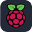

    <h1>DisketteFox</h1>
    <h4>Web developer · Programming student</h4>

 

# Welcome to my profile

Hi! I am a little developer learning markup and programming languages.
In this page you can find some of my school and personal projects.

## 🪴 About me

Right now, I am a programming student, so I mainly work on projects that have been assigned to me, but I also like to explore and do my own ones. Not all of them are related to programming, but I always try to be creative, and I love contributing to open source or libre projects, such as [Wikipedia](https://wikipedia.org) 

I'm currently studying cross-platform application development.

## 📜 Languages I know

## 🪛 Software / Tools I use

## 💬 Locales

Feel free to talk to me in any language listed below:

- `en` (English)
- `es` (Spanish)

###### And that's all for now. See ya! <small></small>

