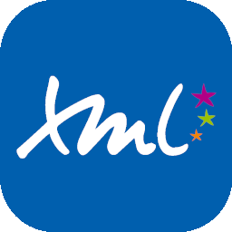

# DisketteFox

###### Web developer · Programming student

 

# Welcome to my profile 😸

Hi! My name is Miles, also known as **DisketteFox**, and I am a little developer learning markup and programming languages.
In this page you might see my school projects and my attempts at my own projects.

## 🪴 About me

I'm a **web developer**.

A lot of my free time is dedicated to **free/libre** internet communities, such as [Wikipedia](https://wikipedia.org).

Currently studying cross-platform application development.

## 📒 My history

Since I was a child I have been fascinated by everything related to computers. Programs, intenet, and so on; so I decided to get myself into this world.
I started with [Scratch](https://scratch.mit.edu/) for 5 years, which molded my mind to understand programming structures, helping me to start programming.
My first real programming language was [Python](https://en.wikipedia.org/wiki/Python_(programming_language)) which I have sudied by myself on my free time when I was 11. Meanwhile, I also started some [Arduino](https://en.wikipedia.org/wiki/Arduino) projects, which really got me into participating in some bigger projects.
Some years later, I started digging into videogame modding, with what I've learnt a little bit of [lua](https://en.wikipedia.org/wiki/lua) and [json](https://en.wikipedia.org/wiki/json).
After some time I decided that I wanted to learn how to make a webpage and after two months of studying, I've learnt enough [HTML](https://en.wikipedia.org/wiki/html) and [CSS](https://en.wikipedia.org/wiki/css) to create a good website.
On my first year studying programming, I've learnt [Java](https://en.wikipedia.org/wiki/Java_(programming_language)), [XML](), [SQLite](), [SQL](), [Java Script]() and [Git](); and I have developed my knowledge on Python, HTML, CSS and JSON.

## 📜 Languages I know

## 🪛 Software / Tools I use

## 💬 Locales

Feel free to talk to me in any language listed as a [RFC 5646](https://www.rfc-editor.org/rfc/rfc5646.html) below:

- `en` (English)
- `es` (Spanish)

###### And that's all for now. See ya! <small>😺</small>

